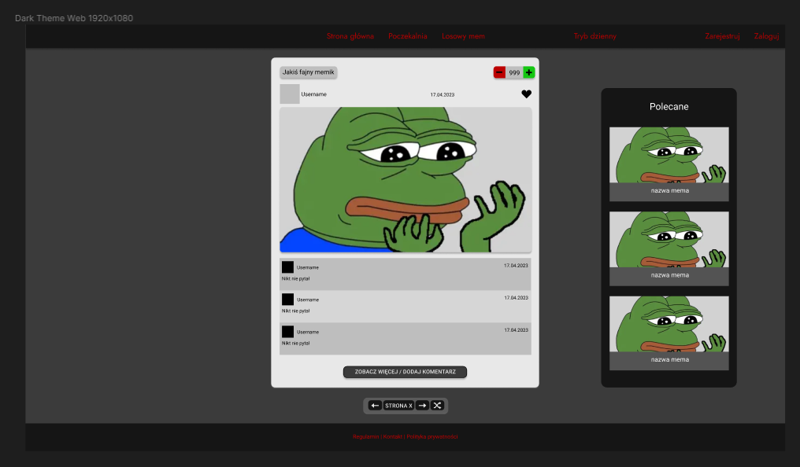

## Cel projektu

Za cel obraliśmy sobie stworzenie platformy z memami, na której użytkownicy mogą łatwo przeglądać, udostępniać i komentować memy. Strona ma na celu dostarczenie użytkownikom rozrywki i humoru poprzez kolekcję memów z różnych kategorii, tematów i gatunków. Użytkownicy będą mogli przeglądać memy, lajkować, komentować i udostępniać swoje ulubione memy. Dodatkowo, strona umożliwi użytkownikom dodawanie własnych memów, co pozwoli na interaktywną i dynamiczną społeczność, gdzie będą mogli się dzielić swoimi kreatywnymi tworami z innymi użytkownikami. Celem strony jest zatem zapewnienie użytkownikom miejsca, gdzie mogą się bawić, śmiać i cieszyć się memami w przyjaznej i interaktywnej atmosferze.

### Zaimplementowane technologie

HTML - język znaczników używanym do tworzenia struktur i zawartości stron internetowych. Pozwala na definiowanie elementów takich jak nagłówki, paragrafy, listy, tabele, obrazy i linki. HTML jest podstawowym składnikiem stron internetowych i jest interpretowany przez przeglądarki internetowe.

CSS - język używanym do opisywania wyglądu i formatowania stron internetowych napisanych w HTML. Pozwala na kontrolę takich aspektów jak kolory, czcionki, marginesy, wyrównanie, tło i wiele innych. Dzięki CSS możemy oddzielić prezentację strony od jej zawartości, co ułatwia utrzymanie i modyfikację stylu strony.

PHP - język programowania często używanym do tworzenia stron internetowych dynamicznych. PHP pozwala na generowanie dynamicznej zawartości, przetwarzanie formularzy, manipulację plikami, interakcję z bazami danych i wiele innych. Skrypty PHP są wykonywane po stronie serwera i wynik ich działania jest przesyłany do przeglądarki.

Docker - platforma open-source do wdrażania i uruchamiania aplikacji w kontenerach. Kontenery Docker są lekkimi, przenośnymi i izolowanymi jednostkami, które zawierają wszystko, co jest potrzebne do uruchomienia aplikacji, włącznie z kodem, zależnościami i konfiguracją. Dzięki Dockerowi można łatwo uruchomić aplikację na różnych środowiskach, niezależnie od systemu operacyjnego czy konfiguracji sprzętowej.

PostgreSQL - potężny, otwartoźródłowy system zarządzania bazą danych relacyjnych. Posiada wiele zaawansowanych funkcji, takich jak transakcje, klucze obce, indeksy, widoki i triggery. PostgreSQL obsługuje standardowy język zapytań SQL oraz oferuje rozszerzenia, które umożliwiają bardziej zaawansowane operacje i funkcje.

JavaScript - skryptowy językiem programowania, który jest wykonywany po stronie klienta (w przeglądarce). JavaScript pozwala na interakcję z elementami strony, manipulację zawartością, obsługę zdarzeń, walidację formularzy i wiele innych. Jest szeroko stosowany do tworzenia interaktywnych i dynamicznych stron internetowych oraz aplikacji internetowych.

### Struktura oraz architektura aplikacji

Dla naszej aplikacji utworzyliśmy następujące drzewo folderów:

W głównym folderze znajdziemy pliki konfiuracyjne takie jak połączenie z bazą danych, routing czy też plik docker-compose służący do panowania nad naszym kontenerem.

W tym momencie mamy 3 podfoldery:

- docker - znajdują się w nim pliki konfiguracyjne dla naszego kontenera
  - nginx - konfiguracja naszego serwera WWW
  - php - konfiguracja naszego języka backendowego
- src - folder dla operacji serwerowych
  - controllers - pliki kontrolujące naszą aplikację
  - data - zmienne przechowywane do importowania w funkcjach
  - models - modele potrzebne do
  - repository - funkcje odpowiedzialne za operacje na bazie danych, ingerujące w jej strukturę
- public - pliki udostępnione dla użytkownika
  - css - pliki stylowania naszych widoków oraz plik główny style.css
    - components - pliki stylowania naszych komponentów
    - variables - zmienne importowane do pozostałych plików stylowania
  - img - zdjęcia wykorzystywane w layoucie strony
  - uploads - zdjęcie dodane przez użytkowników / administartorów
    - ads - reklamy
    - avatars - zdjęcie profilowe
    - memes - memy
  - js - pliki skrytpowe po stronie użytkownika
  - views - widoki, inaczej nasze endpointy, które docelowo wyświetlamy użytkownikowi
    - components - części widoków używane, aby uniknąć redundancji kodu
    - contents - dłuższe testy, przechowywane aby nasz kod pozostał czysty oraz przejrzysty

### Funkcjonalności

...

### Wymagania

| Wymagania funkcjonalne                    | Wymagania niefunkcjonalne                                 |
| ----------------------------------------- | --------------------------------------------------------- |
| przeglądanie memów na stronie głównej     | zmiana motywu kolorystycznego                             |
| przeglądanie memów w poczekalni           | responsywność aplikacji                                   |
| przeglądanie losowych memów               | szybka odpowiedź na interakcje                            |
| przeglądanie ulubionych memów             | skalowalność                                              |
| przeglądanie mema wraz z komentarzami     | wieloplatformowość                                        |
| przeglądanie własnych memów               | intuicyjny interfejs                                      |
| przeglądanie memów tygodnia oraz miesiąca | bezpieczeństwo haseł                                      |
| przeglądanie memów danego użytkownika     | bezpieczeństwo avatarów                                   |
| wyświetlanie reklam                       | bezpieczeństwo memów                                      |
| logowanie                                 | zabezpieczenie metody porozumiewania się z serwerem       |
| rejestracja                               | animacje dla przycisków                                   |
| dodawanie memów                           | dodawanie treści po zatwierdzeniu (komentarz, polubienie) |
| dodawanie komentarzy                      | ciągła dostępność                                         |
| dodawanie polubień mema                   | interakcja między użytkownikami (memy, komentarze, opisy) |
| dodawanie mema do ulubionych              | edytowalność profilu                                      |
| przeglądanie profili użytkowników         | łatwość konserwacji (model mvc)                           |
| edycja profilu                            |                                                           |

### Diagramy

#### Diagram ERD

#### Diagram UML

### Figma

Figma to narzędzie do projektowania interfejsów użytkownika (UI) i tworzenia prototypów. Jest to aplikacja internetowa, która umożliwia projektantom, programistom i innym członkom zespołu współpracę w czasie rzeczywistym na projektach.

Oto kilka cech i funkcji Figmy:

- Projektowanie interfejsów użytkownika: Figma umożliwia tworzenie projektów UI, w których projektanci mogą tworzyć i dostosowywać warstwy, kształty, kolory, czcionki i inne elementy graficzne.

- Prototypowanie: Figma pozwala na tworzenie interaktywnych prototypów, które pomagają w wizualizacji interakcji i przepływu użytkownika w projekcie. Można tworzyć linki pomiędzy różnymi ekranami i dodawać animacje.

- Współpraca w czasie rzeczywistym: Figma umożliwia współpracę z innymi osobami na projekcie w czasie rzeczywistym. Użytkownicy mogą jednocześnie edytować projekt, komentować i wymieniać się pomysłami.

- Udostępnianie i prezentowanie projektów: Figma pozwala na udostępnianie projektów innym osobom poprzez udostępnianie linków. Można również tworzyć prezentacje projektów, które umożliwiają pokazywanie projektów innym osobom w trybie prezentacji.

- Biblioteki i komponenty: Figma pozwala tworzyć biblioteki z komponentami, które mogą być używane wielokrotnie w różnych projektach. Dzięki temu można tworzyć spójne i łatwo zarządzalne projekty.

Figma jest popularnym narzędziem wśród projektantów interfejsów użytkownika, ponieważ umożliwia tworzenie projektów w sposób łatwy, elastyczny i umożliwiający współpracę zespołową.

Oto kilka zrzutów z prototypu naszej aplikacji:

[Aby zobaczyć całość naszej pracy, kliknij w ten link](https://www.figma.com/file/t94vF4c78WgwzIS14Ocx5m/IO?node-id=1%3A8&t=epHnj09kp8rHfNhz-1)

## Format Pracy

#### Git workflow to sposób organizacji pracy z systemem kontroli wersji Git. Istnieje wiele różnych podejść do tego, ale jednym z popularnych modeli jest GitFlow. Oto krótka informacja na temat działania GitFlow:

- Głównym elementem GitFlow są dwie gałęzie: "master" i "develop". Gałąź "master" zawiera stabilny kod produkcyjny, natomiast gałąź "develop" służy do integracji kodu.

- Aby rozpocząć pracę nad nowym zadaniem, tworzymy gałąź funkcji od gałęzi "develop". Ta gałąź jest tworzona dla każdej nowej funkcji, której praca jest rozpoczynana.

- Kiedy praca nad funkcją zostanie ukończona, gałąź funkcji jest scalana z gałęzią "develop". W ten sposób wprowadzamy zmiany do głównej gałęzi projektu.

- Przed wprowadzeniem zmian z gałęzi "develop" do "master" tworzona jest gałąź "release". Na tej gałęzi dokonywane są ostatnie poprawki, testy i przygotowania przed wydaniem nowej wersji.

- Po zakończeniu prac na gałęzi "release", jest ona scalana z gałęzią "master", a także z gałęzią "develop". Dodatkowo, po scaleniu z gałęzią "master", oznaczamy ten punkt jako nową wersję oprogramowania.

- Jeśli wystąpią błędy lub problemy po wydaniu wersji, naprawki są wykonywane na gałęzi "hotfix". Gałąź "hotfix" jest tworzona bezpośrednio z gałęzi "master", aby umożliwić szybkie wprowadzenie poprawek do stabilnej wersji.

- Po naprawieniu błędu na gałęzi "hotfix", zmiany są scalane z gałęzią "master" i "develop". Po scaleniu z "master" oznaczamy ten punkt jako nową wersję.

GitFlow pomaga w zorganizowaniu pracy zespołu, umożliwiając równoczesne tworzenie nowych funkcji, poprawki błędów oraz utrzymanie stabilnej wersji produkcyjnej.

##### Z racji poziomu zaawansowania projektu oraz faktu, iż jest to dopiero prototyp, ominiemy gałęzie takie jak release oraz hotfix.

## Kierunek rozwoju

Aplikacja przez swoją łatwą skalowalność może w przyszłości wiele funckcji i nowych rozwiązań dla starych metod, oto niektóre z nich:

- Przeglądanie memów w formie przesuwania obrazka (głównie dla użytkowników mobilnych).

- Dodanie w pełni działającego panelu admina.

- Dodanie ciasteczek spełniających rolę pozyskania teści wyszukiwanych przez użytkownika.

- Podział memów na podkategorie.

- Możliwość odpowiadania na komentarze.

- Możliwość reagowania na komentarze.

- Dodanie sekcji premium oraz kont bez reklam.

- Dodanie wyszukiwania memów przez wpisanie tytułu.

- Dodanie kolejnych rozszerzeń plików (.mp4 / .gif).

- Dodanie filtrowania przez rodzaj mema (obrazek / text / gif).

- Rejestracja / logowanie za pomocą stron takich jak facebook.

- Punkty użytkownika dla najbardziej rozchwytywanych.

- Specjalne reakcje na memy.

Oraz wiele, wiele więcej...

## Bezpieczeństwo aplikacji

### Logowanie i rejestracja

Aplikacja zapewnia funkcjonalność logowania i rejestracji, co umożliwia kontrolę dostępu do danych. W celu zabezpieczenia tych procesów, zastosowano następujące środki bezpieczeństwa:

- Hasła są hashowane przed zapisaniem ich w bazie danych. Dzięki temu, nawet w przypadku naruszenia bazy danych, niemożliwym jest odzyskać oryginalne hasła.
- Przy rejestracji nowego konta, sprawdzane są unikalność adresów e-mail oraz nazw użytkowników, aby zapobiec duplikatom i potencjalnym atakom na konta użytkowników.
- W przypadku logowania, zastosowano technikę uwierzytelniania z wykorzystaniem sesji. Sesje są odpowiednio zarządzane i zabezpieczane przed atakami typu session hijacking czy session fixation.

### Metody POST

Aplikacja korzysta z metody POST do przesyłania danych między klientem a serwerem. W celu zapewnienia bezpieczeństwa przesyłanych informacji, zastosowano następujące środki:

- Dane przesyłane za pomocą metody POST są szyfrowane za pomocą protokołu HTTPS, co zapewnia poufność i integralność danych podczas transmisji.
- Weryfikacja poprawności i integralności danych jest przeprowadzana po stronie serwera, aby zapobiec atakom typu SQL injection czy cross-site scripting (XSS).

### Hashowanie haseł, memów oraz avatarów

W celu zabezpieczenia poufności i integralności haseł, memów oraz avatarów, zastosowano technikę hashowania. Poniżej przedstawiono szczegóły dotyczące każdego z tych elementów:

- Hasła użytkowników są hashowane przed zapisaniem ich do bazy danych. Zastosowano silne funkcje haszujące, takie jak bcrypt, aby utrudnić odtworzenie oryginalnych haseł w przypadku naruszenia bazy danych.
- Memy oraz avatarów również poddawane są procesowi hashowania przed zapisaniem ich do bazy danych. To zapewnia zachowanie integralności tych elementów i utrudnia manipulację nimi.

Dzięki zastosowaniu powyższych środków bezpieczeństwa, aplikacja dba o ochronę danych użytkowników i minimalizuje ryzyko naruszenia bezpieczeństwa.

## Dodatkowe informacje

...
